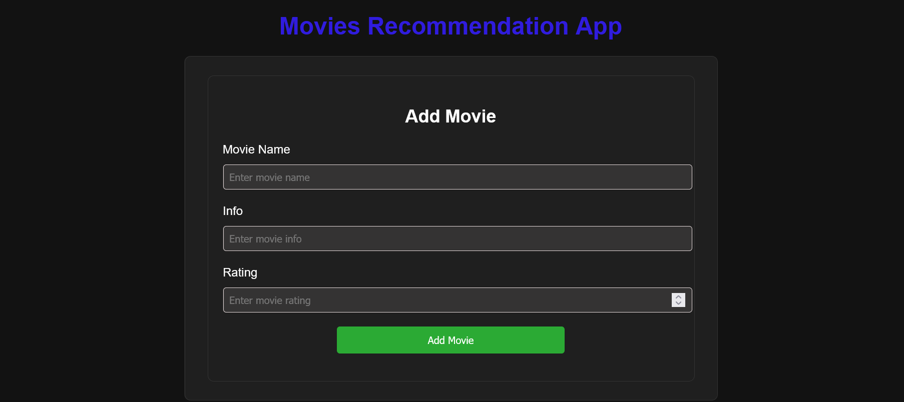
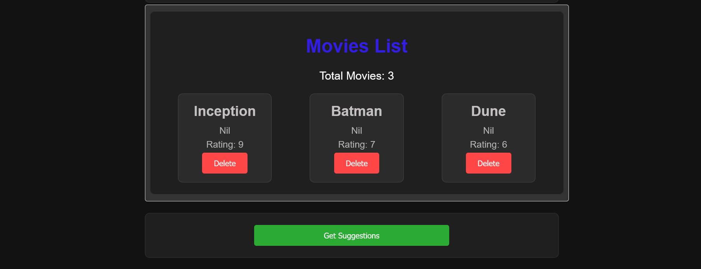
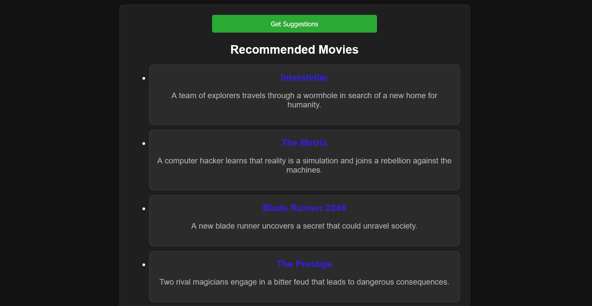

# Movies Recommendation App

Welcome to the Movies Recommendation App! This project is a full-stack application built with the MERN stack (MongoDB, Express, React, Node.js) that allows users to manage and get recommendations for movies.

## Live Demo

Check out the live demo of the application [here](https://movies-react-app.onrender.com).

## Features

- Add new movies
- View all movies
- Delete movies
- Get movie recommendations

## Screenshots

*Movie Form*


*Movie List*


*Movie Suggestions*


## Getting Started

To host this app locally on your system, follow these steps:

### Prerequisites

Make sure you have the following installed on your system:

- Node.js
- MongoDB
- Git

### Installation

1. **Clone the repository**

    ```bash
    git clone https://github.com/SarthakYelne/movies-recommendation-app.git
    cd movies-recommendation-app
    ```

2. **Set up the backend**

    ```bash
    cd backend
    npm install
    ```

3. **Set up the frontend**

    ```bash
    cd frontend
    npm install
    ```

### Running the Application

1. **Start the backend server**

    Navigate to the `backend` directory and start the server:

    ```bash
    cd backend
    npm run start
    ```

    The backend server will start on `http://localhost:8000`.

2. **Start the frontend development server**

    Navigate to the `frontend` directory and start the development server:

    ```bash
    cd frontend
    npm run dev
    ```

    The frontend server will start on .

### Environment Variables

Create a `.env` file in the `backend` directory and add the following environment variables:
Replace `mongodb_connection` with your actual MongoDB connection string.

### Project Structure

- `backend`: Contains the Express server, MongoDB models, and API routes.
- `frontend`: Contains the React application.

### Technologies Used

- **Frontend**: React, Axios, React Router
- **Backend**: Node.js, Express, MongoDB, Mongoose
- **Other Tools**: dotenv, cors

## Contributing

Feel free to contribute to this project by opening issues and submitting pull requests. Please follow the project's code of conduct.

---

Feel free to reach out if you have any questions or need further assistance.

Happy Coding! 